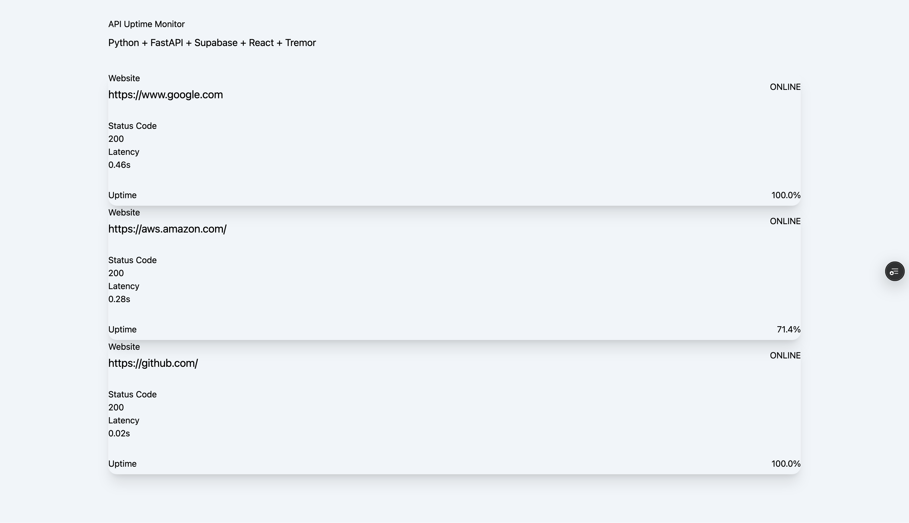

# Uptime Monitor

A full-stack uptime monitoring dashboard built using:

- Python
- FastAPI
- Supabase
- React
- Tremor
- TailwindCSS
- Vercel Cron Jobs

This project periodically checks website/API availability, stores results in Supabase, and visualizes uptime metrics through a modern dashboard.

---

# Features

- Automated uptime checks
- Multi-domain monitoring
- Latency tracking
- Uptime percentage calculations
- Real-time dashboard refresh
- Serverless FastAPI backend
- Vercel cron scheduling
- Supabase cloud database

---

# Architecture

```text
Vercel Cron
      ↓
FastAPI Endpoint
      ↓
Async Python Uptime Checks
      ↓
Supabase PostgreSQL
      ↓
React + Tremor Dashboard
```

---

# Tech Stack

## Backend

- Python
- FastAPI
- httpx
- Supabase Python SDK

## Frontend

- React
- Vite
- Tremor
- TailwindCSS

## Infrastructure

- Vercel
- Supabase

---

# Project Structure

```text
project/
│
├── api/
│   └── check-sites.py
│
├── frontend/
│   ├── src/
│   ├── package.json
│   └── vite.config.js
│
├── requirements.txt
├── vercel.json
└── README.md
```

---

# Backend Setup

## Install Dependencies

```bash
pip install -r requirements.txt
```

## requirements.txt

```text
fastapi
supabase
httpx
python-dotenv
```

---

# Frontend Setup

Navigate into frontend:

```bash
cd frontend
```

Install dependencies:

```bash
npm install
```

Install required packages:

```bash
npm install @supabase/supabase-js
npm install @tremor/react
npm install -D tailwindcss @tailwindcss/vite
```

Run development server:

```bash
npm run dev
```

---

# Environment Variables

## Frontend `.env`

```env
VITE_SUPABASE_URL=your_supabase_url
VITE_SUPABASE_ANON_KEY=your_publishable_key
```

## Vercel Environment Variables

```env
SUPABASE_URL=your_supabase_url
SUPABASE_KEY=your_service_role_key
```

---

# Supabase Table Schema

Run in Supabase SQL Editor:

```sql
CREATE TABLE uptime_checks (
    id BIGSERIAL PRIMARY KEY,
    domain TEXT,
    status_code INT,
    response_time FLOAT,
    timestamp TIMESTAMP
);
```

---

# Row Level Security (RLS)

Enable RLS:

```sql
ALTER TABLE uptime_checks
ENABLE ROW LEVEL SECURITY;
```

Allow public reads:

```sql
CREATE POLICY "Public read"
ON uptime_checks
FOR SELECT
TO anon
USING (true);
```

---

# FastAPI Endpoint

Example route:

```python
@app.get("/api/check-sites")
async def check_sites():
```

The endpoint:

- checks configured websites
- measures latency
- stores results in Supabase
- returns JSON response

---

# Vercel Cron Job

## vercel.json

```json
{
  "crons": [
    {
      "path": "/api/check-sites",
      "schedule": "0 0 * * *"
    }
  ]
}
```

This runs the uptime checker once per day.

---

# Local Development

## Start Frontend

```bash
cd frontend
npm run dev
```

## Test Backend Endpoint

```text
https://your-vercel-project.vercel.app/api/check-sites
```

---

# Dashboard Metrics

The dashboard currently shows:

- Website status
- HTTP response code
- Response latency
- Uptime percentage

Grouped by domain.

---

# Future Improvements

- Real-time Supabase subscriptions
- Incident timeline
- Authentication
- Multi-region monitoring
- Slack/Discord alerts
- Response-time charts
---

# Learning Outcomes

This project demonstrates:

- Full-stack application development
- Serverless backend architecture
- React dashboard development
- Supabase integration
- Cron job scheduling
- Async Python programming
- API monitoring concepts
- Cloud deployment workflows

---

# Deployment

## Frontend

Deploy using:

- Vercel

## Backend

Serverless FastAPI endpoint deployed on:

- Vercel Functions

## Database

Hosted on:

- Supabase PostgreSQL

---

# License

MIT
